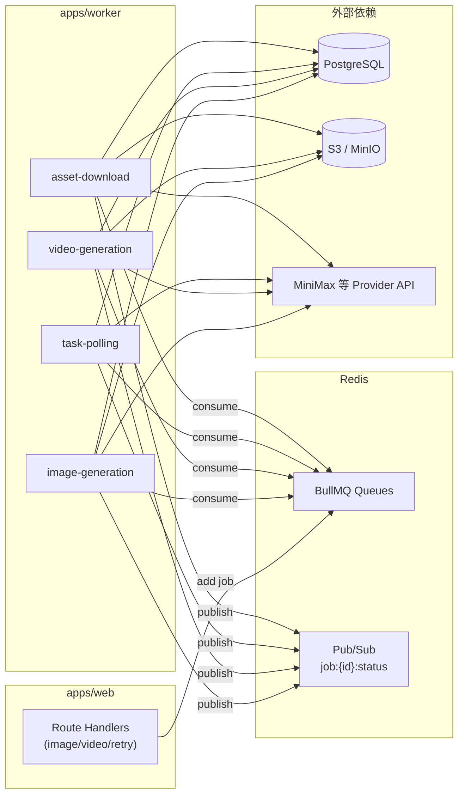

# @ai-magic/worker — 异步任务执行服务

本目录为 **AI 生成任务的后台 Worker**：从 **BullMQ + Redis** 队列消费任务，调用 **AI Provider**（当前启动时注册 `MiniMaxProvider`），通过 **Prisma** 读写 PostgreSQL，将产出写入 **S3 兼容对象存储**，并通过 **Redis Pub/Sub** 广播任务状态。

Web 应用（`apps/web`）的 BFF API 主要负责创建 `generationJob` 记录并把任务 **入队**；耗时操作（调用模型、异步轮询、下载大文件、上传存储）均在 Worker 中执行，避免阻塞 HTTP 请求。

---

## 在整体架构中的位置



---

## 技术栈

| 类别 | 依赖 / 说明 |
|------|-------------|
| 运行时 | Node.js + `tsx`（开发 watch / 生产可直接 `tsx src/index.ts`） |
| 队列 | [BullMQ](https://docs.bullmq.io/) |
| Redis 客户端 | [ioredis](https://github.com/redis/ioredis)（`maxRetriesPerRequest: null` 以符合 BullMQ 要求） |
| 数据库 | `@ai-magic/db`（Prisma Client） |
| AI 厂商 | `@ai-magic/providers`（`registerProvider`、`getProvider`） |
| Prompt | `@ai-magic/prompts`（`buildImagePrompt`、`buildVideoPrompt`） |
| 对象存储 | `@aws-sdk/client-s3`、`@aws-sdk/s3-request-presigner` |
| 图片处理 | `sharp`（依赖已声明，可按需用于后续处理） |

---

## 目录结构

```
apps/worker/
├── package.json
├── tsconfig.json
└── src/
    ├── index.ts                 # 入口：Redis 连接、注册 Provider、启动 4 个 Worker、信号优雅退出
    ├── lib/
    │   ├── publish.ts           # Redis 发布任务状态
    │   └── storage.ts           # S3 上传与预签名读 URL
    └── processors/
        ├── image-generation.ts  # 图片生成全流程
        ├── video-generation.ts  # 提交图生视频异步任务并入队轮询
        ├── polling.ts           # 轮询 Provider 异步任务状态
        └── asset-download.ts    # 下载视频产物并上传 S3、落库
```

---

## 队列与并发

入口文件 `src/index.ts` 注册四个 BullMQ `Worker`，队列名与处理器如下：

| 队列名 | 处理器 | 并发 | 职责摘要 |
|--------|--------|------|----------|
| `image-generation` | `processImageGeneration` | 4 | 文生图 / 参考图生图：拼 prompt、调 Provider、结果写入 S3、创建 `Asset`、记 `costLedger`、更新 `generationJob` |
| `video-generation` | `processVideoGeneration` | 2 | 图生视频：输入帧预签名 URL、调异步 API、保存 `providerTaskId`、延迟入队 `task-polling` |
| `task-polling` | `processPolling` | 4 | 查询异步任务；成功则更新 `providerFileId` 并入队 `asset-download`；失败/超时则标记失败 |
| `asset-download` | `processAssetDownload` | 4 | 从 Provider 拉取视频二进制、上传 S3、创建视频 `Asset`、记成本、任务成功；失败为 `DOWNLOAD_FAILED` |

**Provider 注册**：进程启动时执行 `registerProvider(new MiniMaxProvider())`，各处理器通过 `getProvider(genJob.provider)` 或任务数据中的 `provider` 名称解析具体实现。

---

## 业务流程说明

### 1. 图片生成（`image-generation`）

1. 根据 `generationJobId` 加载 `generationJob`，关联 `outfit` 与 `characterTemplate`。
2. 将任务状态更新为 `RUNNING`，写入 `startedAt`，并 `publishJobStatus(jobId, "RUNNING")`。
3. **Prompt**：若库中已有 `promptText`（及可选 `promptJson`）则直接使用；否则调用 `buildImagePrompt`，根据角色模板、穿搭、机位、场景等字段拼装。
4. **参考图**：若模板有 `referenceAssetId`，则从 `asset` 表取 `storageKey`，通过 `storage.getSignedUrl` 得到临时 URL，作为 `subjectReferenceUrls` 传给 Provider。
5. 调用 `provider.generateImages`（数量固定为 1，宽高比来自 `outfit.aspectRatio`，默认 `9:16`）。
6. 从返回的 URL 或 base64 得到 `Buffer`，以 `images/{uuid}.png` 键上传 S3，`Content-Type: image/png`。
7. 创建 `IMAGE` 类型 `asset`；按 Provider 的 `estimateCost` 写入 `costLedger`（`billingUnit: PER_IMAGE`）。
8. 更新 `generationJob`：`SUCCEEDED`、`outputAssetId`、回写最终 `promptText` / `promptJson` / `seed`（若模型返回）、`finishedAt`。
9. 发布 `SUCCEEDED`（携带 `assetId`）。任意异常则 `FAILED`、写 `errorMessage`、再抛出让 BullMQ 记录失败。

### 2. 视频生成（`video-generation` + `task-polling` + `asset-download`）

**阶段 A — `video-generation`**

1. 加载任务，必须存在 `inputAsset` 且带 `storageKey`（首帧图）。
2. 状态置 `RUNNING` 并发布。
3. 对输入图 `storageKey` 生成预签名 URL，供 Provider 拉取。
4. **Prompt**：有现成 `promptText` 则用；否则 `buildVideoPrompt`（动作模板、机位、场景描述等）。
5. 调用 `provider.generateVideoFromImage`（时长、分辨率来自 job 或 outfit 默认值）。
6. 将返回的异步 `taskId` 写入 `providerTaskId`，更新 prompt 字段。
7. 向 `task-polling` 队列添加一条 `poll` 任务，`delay: 5000` ms，附带 `attempt: 0`。
8. 发布说明性 `RUNNING`（如「已提交、开始轮询」）。异常则 `FAILED`。

**阶段 B — `task-polling`**

1. 调用 `provider.getTask(providerTaskId)`。
2. **`SUCCEEDED`**：更新 DB 中的 `providerFileId`（及 Provider 返回的 `outputUrl` 等由后续下载使用）；向 `asset-download` 入队；发布 `RUNNING`（如「正在下载视频」）。
3. **`FAILED` / `CANCELED`**：任务标记 `FAILED`，写 `errorMessage`、`finishedAt`，发布 `FAILED`。
4. **仍在进行**：若 `attempt >= 120`（`MAX_POLL_ATTEMPTS`），标记失败原因为 `Polling timeout`。
5. 否则计算带抖动的延迟（指数退避，上限约 60s），再次向 `task-polling` 添加同一逻辑任务且 `attempt + 1`。

**阶段 C — `asset-download`**

1. `provider.downloadAsset`（`fileId` / `url` 来自轮询结果）。
2. 默认以 `videos/{uuid}.mp4` 上传 S3；创建 `VIDEO` 类型 `asset`。
3. `estimateCost` 阶段为 `VIDEO`，`billingUnit: PER_SECOND` 等写入 `costLedger`。
4. 更新 `generationJob` 为 `SUCCEEDED` 并绑定 `outputAssetId`；发布 `SUCCEEDED`。
5. 异常时状态为 `DOWNLOAD_FAILED`（与 Provider 侧失败区分），发布 `DOWNLOAD_FAILED`。

---

## 状态通知（Redis Pub/Sub）

`src/lib/publish.ts` 使用独立 Redis 连接发布消息：

- **Channel**：`job:{jobId}:status`
- **Payload**：JSON，至少包含 `status`、`timestamp`；可选 `message`、`assetId`、`error` 等扩展字段。

前端或其它服务可订阅该频道以实现实时进度（具体消费方式由 `apps/web` 等决定）。

---

## 环境变量

| 变量 | 用途 | 默认 / 说明 |
|------|------|-------------|
| `REDIS_URL` | BullMQ 与 Pub/Sub | 默认 `redis://localhost:6379` |
| `S3_ENDPOINT` | S3 客户端 endpoint | 本地 MinIO 等需配置 |
| `S3_REGION` | 区域 | 默认 `us-east-1` |
| `S3_ACCESS_KEY_ID` | 访问密钥 | 空字符串若未设（可能导致上传失败） |
| `S3_SECRET_ACCESS_KEY` | 密钥 | 同上 |
| `S3_FORCE_PATH_STYLE` | 路径风格（MinIO 常见） | 设为 `"true"` 启用 |
| `S3_BUCKET` | 存储桶名 | 默认 `ai-magic` |

数据库连接字符串等由 `@ai-magic/db` / 根目录 `.env` 约定，与 Monorepo 其它应用一致。

Provider（MiniMax 等）的 API Key 等通常在 `packages/providers` 或共享环境变量中读取，请参照仓库根目录 `.env.example`。

---

## 与 Web BFF 的对应关系

以下路由会向 BullMQ **添加**任务（Worker 负责 **消费**）：

| 路由文件 | 队列入队 |
|----------|----------|
| `apps/web/src/app/api/generations/image/route.ts` | `image-generation` |
| `apps/web/src/app/api/generations/video/route.ts` | `video-generation` |
| `apps/web/src/app/api/jobs/[id]/retry/route.ts` | `image-generation` 或 `video-generation`（按任务类型） |

`task-polling` 与 `asset-download` 由 Worker 内部处理器链式入队，Web 端一般不直接投递。

---

## 本地开发与运行

在仓库根目录已配置脚本（见根 `README.md`）：

```bash
# 安装依赖（在 monorepo 根目录）
pnpm install

# 确保 Redis、PostgreSQL、S3（如 MinIO）可用，且 .env 已配置

# 仅启动 Worker（开发 watch）
pnpm dev:worker
```

等价于在根目录执行：

```bash
pnpm --filter @ai-magic/worker dev
```

在 `apps/worker` 目录内也可：

```bash
pnpm dev    # tsx watch src/index.ts
pnpm start  # tsx src/index.ts
pnpm typecheck
```

**注意**：若只启动 `pnpm dev`（Web）而不启动 Worker，入队任务会堆积在 Redis 中，界面可能长期停留在排队/运行中而无结果。

---

## 进程生命周期

- `SIGINT` / `SIGTERM`：并行关闭所有 BullMQ Worker、断开 Prisma、退出 Redis 连接后 `process.exit(0)`。
- 各 Worker 监听 `completed` / `failed` 并在控制台打印日志。

---

## 小结

| 问题 | 答案 |
|------|------|
| Worker 做什么？ | 异步执行图片生成、视频生成（含轮询与下载）、更新数据库与对象存储、广播任务状态。 |
| 与 Web 的分工？ | Web 入队 + 鉴权/业务校验；Worker 执行重活。 |
| 必须依赖？ | Redis、PostgreSQL、S3 兼容存储、可用的 AI Provider 配置。 |

更上层的产品说明与一键启动步骤见仓库根目录 [`README.md`](../../README.md)。
