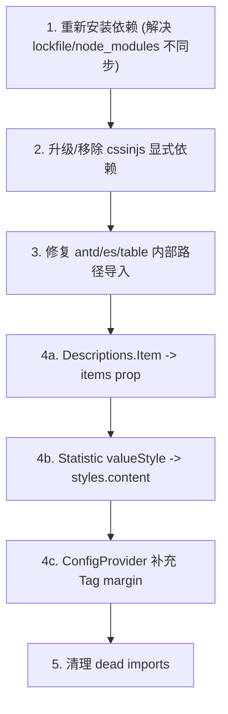

# apps/web 依赖包兼容性深度分析与修复计划

---

## 问题 1 -- CRITICAL: antd 版本声明与实际安装严重不一致

**现象**:

- `package.json` 声明: `"antd": "^6.0.0"`, `"@ant-design/icons": "^6.0.0"`
- `pnpm-lock.yaml` 引用: `antd@6.3.5`
- **实际 node_modules**: `antd@5.29.3`, `@ant-design/icons@5.6.1`

npm registry 上 antd latest = **6.3.5**, @ant-design/icons latest = **6.1.1**, 均已正式发布。

**影响**:

- 当前代码实际运行在 antd 5.x 上, 但 package.json 声明 6.x
- 如果有人删除 node_modules 重新 `pnpm install`, 可能会安装到 6.x, 导致行为不可预测
- 锁文件与 node_modules 不同步, CI/CD 环境可能产生不同结果

**修复方案**: 二选一

| 方案             | 操作                                                            | 适用场景                                       |
| ---------------- | --------------------------------------------------------------- | ---------------------------------------------- |
| A: 升级到 antd 6 | `pnpm --filter @ai-magic/web add antd@6 @ant-design/icons@6`    | 拥抱新版, 需同时处理下面的 cssinjs 和 API 迁移 |
| B: 锁定 antd 5   | 将版本改为 `"antd": "^5.29.0"`, `"@ant-design/icons": "^5.6.0"` | 保持稳定, 暂不迁移                             |

**建议**: 选方案 A (升级到 v6), 因为 package.json 本意就是 v6, 且 v6 与 React 19 / Next.js 16 兼容更好。

---

## 问题 2 -- CRITICAL: @ant-design/cssinjs 版本冲突

**现象**:

- `package.json` 显式声明: `"@ant-design/cssinjs": "^1.23.0"` -> 安装了 1.24.0
- antd 6.x 的 `dependencies` 要求: `"@ant-design/cssinjs": "^2.1.2"`
- antd 6 默认使用 CSS Variables 模式, 依赖 cssinjs v2 的新特性

**影响**:

- 升级 antd 到 6.x 后, 项目显式安装的 cssinjs 1.x 与 antd 内部依赖的 cssinjs 2.x 会产生两份实例
- `@ant-design/nextjs-registry` 的 SSR 样式提取可能使用错误版本的 cssinjs, 导致服务端/客户端样式不匹配 (hydration error)

**修复**: 将 `@ant-design/cssinjs` 版本改为 `"^2.1.2"`, 或者直接删除这个显式依赖 (让 antd 6 自己带入正确版本)。

---

## 问题 3 -- MODERATE: antd 内部路径导入可能在 v6 中失效

**文件**: [apps/web/src/app/app/outfits/page.tsx](apps/web/src/app/app/outfits/page.tsx)

```typescript
import type { ColumnsType } from "antd/es/table";
```

`antd/es/table` 是 antd 内部模块路径, 在 v6 中可能发生变更 (v6 对内部 rc-\* 组件做了大量替换)。

**修复**: 改为使用公开导出:

```typescript
import type { TableColumnsType } from "antd";
```

---

## 问题 4 -- WARNING: 多处使用 v6 已废弃 API (v7 将移除)

根据 [antd v5 -> v6 迁移文档](https://ant.design/docs/react/migration-v6), 以下 API 在 v6 中标记为 deprecated, 会产生控制台警告, 将在 v7 中移除:

### 4a. `Descriptions.Item` 子元素模式 -> 应改用 `items` prop

涉及 3 个文件, 约 27 处 `Descriptions.Item`:

- [template-detail-drawer.tsx](apps/web/src/app/app/templates/template-detail-drawer.tsx) - 12 处
- [outfits/\[id\]/page.tsx](apps/web/src/app/app/outfits/[id]/page.tsx) - 6 处
- [assets/page.tsx](apps/web/src/app/app/assets/page.tsx) - 9 处

迁移方式:

```tsx
// Before (deprecated)
<Descriptions column={1} size="small">
  <Descriptions.Item label="名称">{data.name}</Descriptions.Item>
  <Descriptions.Item label="描述">{data.description}</Descriptions.Item>
</Descriptions>

// After
<Descriptions
  column={1}
  size="small"
  items={[
    { label: "名称", children: data.name },
    { label: "描述", children: data.description },
  ]}
/>
```

### 4b. `Statistic` 的 `valueStyle` -> 应改用 `styles.content`

涉及 [outfits/\[id\]/page.tsx](apps/web/src/app/app/outfits/[id]/page.tsx), 2 处:

```tsx
// Before (deprecated)
<Statistic valueStyle={{ color: "#c9a96e" }} ... />

// After
<Statistic styles={{ content: { color: "#c9a96e" } }} ... />
```

### 4c. Tag 默认 margin 移除

antd v6 移除了 `Tag` 组件的尾部默认 `margin-inline-end`。当前项目多个页面大量使用 `Tag` 组件, 升级后 Tag 之间的水平间距会消失。

涉及页面: dashboard, templates, outfits, assets, reviews, costs, settings

**修复**: 在 `ConfigProvider` 中全局恢复:

```tsx
<ConfigProvider
  tag={{ styles: { root: { marginInlineEnd: 8 } } }}
>
```

---

## 问题 5 -- MINOR: 无用导入 (dead imports)

| 文件                                                                  | 无用导入              |
| --------------------------------------------------------------------- | --------------------- |
| [outfits/\[id\]/page.tsx](apps/web/src/app/app/outfits/[id]/page.tsx) | `Modal`, `Popconfirm` |
| [settings/page.tsx](apps/web/src/app/app/settings/page.tsx)           | `Divider`             |

---

## 其他依赖兼容性 -- 无问题

| 依赖组合                               | 版本                                     | 兼容结论 |
| -------------------------------------- | ---------------------------------------- | -------- |
| React 19.2.4 + Next.js 16.2.4          | Next 16 peerDep: `react ^19.0.0`         | OK       |
| antd 6 + React 19                      | antd 6 peerDep: `react >=18.0.0`         | OK       |
| zustand 5 + React 19                   | peerDep: `react >=18.0.0`                | OK       |
| @tanstack/react-query 5 + React 19     | 支持 React 18/19                         | OK       |
| jose 6                                 | 无 peerDep                               | OK       |
| bcrypt 5 + @types/bcrypt 5             | Node >=10                                | OK       |
| dayjs 1.11                             | antd 6 仍使用 dayjs                      | OK       |
| zod 3.24                               | 无 peerDep                               | OK       |
| sharp 0.33                             | Node native addon                        | OK       |
| tailwindcss 4 + @tailwindcss/postcss 4 | 配套版本                                 | OK       |
| bullmq 5 + ioredis 5                   | 服务端依赖, 无 React 关联                | OK       |
| @ant-design/nextjs-registry 1.3.0      | peerDep: `antd >=5.0.0`, `next >=14.0.0` | OK       |

---

## 已正确使用的模式 (无需修改)

- `Menu` 使用 `items` prop (非 children) -- 符合 v6 推荐
- `Timeline` 使用 `items` prop -- 符合 v6 推荐
- `Drawer` 使用 `open` prop (非 `visible`) -- 符合 v6 要求
- `Modal` 使用 `open` prop (非 `visible`) -- 符合 v6 要求
- `message` 全部通过 `App.useApp()` 获取 -- 符合 v6 最佳实践
- 无 `Modal.confirm` / `Modal.info` 等静态方法调用
- 无 `visible` / `onVisibleChange` / `dropdownClassName` 等旧 prop
- `theme.ts` 中 Menu dark tokens (`darkItemBg` 等) 在 v6 中仍有效

---

## 修复优先级总结


