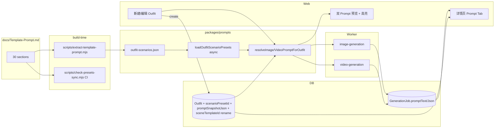
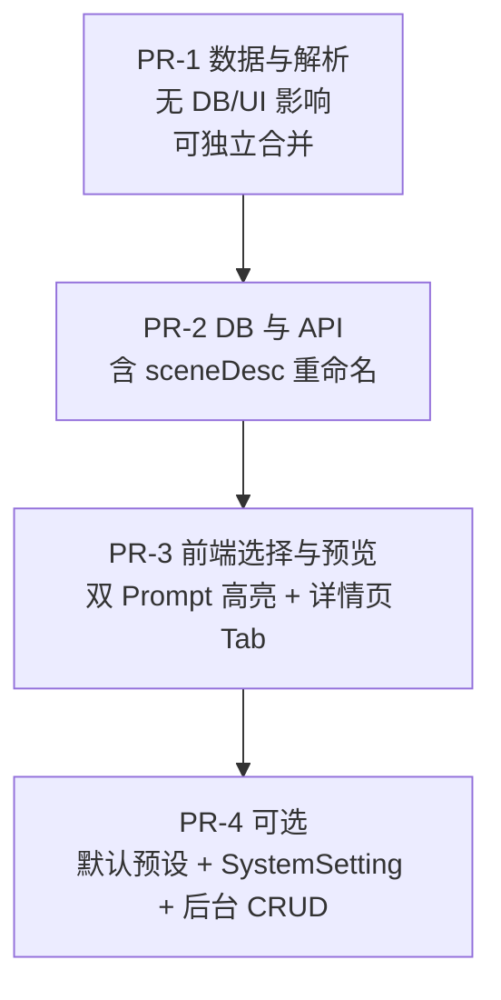

# 场景预设 Prompt 接入（v2 含优化）

## 概览

把 [docs/Template-Prompt.md](docs/Template-Prompt.md) 的 30 套「图 + 视频」中文成品提示词拆解为结构化段沉到 `packages/prompts`，在 `Outfit` 上挂一个可选 `scenarioPresetId`。新建/编辑任务时通过下拉选择，与角色模板、用户字段、镜头动作枚举做合成；结果通过同一纯函数同时供 Web 预览和 Worker 生成使用，从而既能直接调用 AI 出图/出视频，又保留可组合性、可观测性、可演进性。

## 与 v1 的差异（为什么重写）

- 预设形态：v1 整段中文黑盒；v2 拆成 `character/outfit/style/composition/scene/lighting/video.*` 段
- 字段冲突：v1 选预设后用户字段被忽略；v2 合成 + 覆盖优先级 + UI 高亮 + 反向回填确认
- 角色模板：v1 与预设人设互斥；v2 角色模板覆盖预设 character 段
- 比例/时长：v1 表单独立选；v2 预设带 `aspectRatio / recommendedDuration`，可覆盖
- 视频预设：v1 与图片硬绑定；v2 共享 preset，但 `motionTemplate / cameraTemplate` 可独立覆盖
- 多预设搜索：v1 长 Select；v2 tags 分组 + 搜索
- 版本演进：v1 实时拼，预设升级影响在跑任务；v2 `Outfit.promptSnapshotJson` + `presetVersion`，创建 Job 时锁定 promptText
- 文档与代码：v1 一次性导入；v2 `scripts/check-presets-sync.mjs` CI 校验
- 预设管理：v1 仅代码常量；v2 MVP 用 JSON 文件，接口异步化为后续接入 `SystemSetting` 留口
- 可观测性：v1 详情页看不到 Prompt；v2 详情页加 Prompt Tab + 历史快照
- 测试：v1 无；v2 单元 + snapshot
- 命名：v1 沿用 `Outfit.sceneDesc`（实为模板 id 易混淆）；v2 同期重命名为 `sceneTemplateId`

## 总体数据流



---

## 1. 结构化预设数据模型（P0）

### 1.1 类型定义

新建 `packages/prompts/src/types/outfit-scenario.ts`：

```ts
export interface OutfitScenarioVisualSegments {
  character: string;     // 24岁的都市轻熟风女性时尚模特，长直发…
  outfit: string;        // 米白针织 + 浅蓝牛仔 + 卡其西装…
  style: string;         // 都市极简通勤，主色调…
  composition: string;   // 9:16 竖屏，45 度站姿…
  scene: string;         // 现代商场中庭，背景简洁…
  lighting: string;      // 柔和商业自然光…
}

export interface OutfitScenarioVideoSegments {
  motion: string;
  camera: string;
  detail: string;
  background: string;
}

export interface OutfitScenarioPreset {
  id: string;                         // urban_minimal_commute
  label: string;                      // 都市极简通勤风
  tags: string[];                     // ['通勤','极简','春秋','女']
  aspectRatio: '9:16' | '16:9' | '1:1';
  recommendedDuration?: number;       // 6
  version: number;                    // 文案变更时 +1
  image: OutfitScenarioVisualSegments;
  video: OutfitScenarioVideoSegments;
}
```

### 1.2 数据落盘

- `packages/prompts/src/data/outfit-scenarios.json`：上述结构的数组，初始 30 条全部从 [docs/Template-Prompt.md](docs/Template-Prompt.md) 抽取。
- `packages/prompts/src/data/outfit-scenario-tags.ts`：tag 枚举与中文显示名映射，用于 UI 分组。

### 1.3 抽取脚本（双向）

- `scripts/extract-template-prompt.mjs`（一次性）：按 `# N. xxx` 切章 → 取两个 fenced block → 用启发式关键词（「模特/穿着/整体风格/全身时尚摄影/场景/光」）分段，输出 JSON 草稿。
- `scripts/check-presets-sync.mjs`（常驻 CI）：解析 md，与 JSON 做语义对比（trim + 折行后比较），不一致 `process.exit(1)` 并指出偏移项。
  - 真相之源：JSON 为准（直接被代码使用），md 是文档/审稿源；脚本帮助提醒「文档掉队了」。
  - 接入根 [package.json](package.json) 的 `lint` 脚本，CI 强制跑。

### 1.4 加载器（异步签名，为日后落 DB 留口）

`packages/prompts/src/outfit-scenarios.ts`：

```ts
export async function loadOutfitScenarioPresets(): Promise<OutfitScenarioPreset[]>;
export async function findOutfitScenario(id: string): Promise<OutfitScenarioPreset | undefined>;
export async function getOutfitScenarioOptions(filter?: { tags?: string[] }): Promise<{ value: string; label: string; tags: string[] }[]>;
```

MVP 内部从 JSON 同步读，但对外暴露 Promise，后续可无缝替换为「优先读 `SystemSetting.outfit_scenario_presets`，回退 JSON」。

[packages/prompts/src/index.ts](packages/prompts/src/index.ts) 导出全部新符号。

---

## 2. 合成与覆盖策略（P0 核心）

### 2.1 解析函数

新增 `packages/prompts/src/resolve-outfit-prompts.ts`：

```ts
interface ResolveImageInput {
  preset?: OutfitScenarioPreset;
  character?: CharacterInput;              // 来自 CharacterTemplate
  hasReferenceAsset?: boolean;
  outfit?: OutfitInput;                    // 用户在表单填的 top/bottom/...
  cameraId?: string;                       // 现有英文镜头模板 id（可空）
  sceneTemplateId?: string;                // 现有英文场景模板 id（可空）
  backgroundDesc?: string;                 // 自由文本
  aspectRatioOverride?: '9:16'|'16:9'|'1:1';
}

interface ResolveOutput {
  text: string;
  json: {
    mode: 'preset' | 'modular';
    presetId?: string;
    presetVersion?: number;
    aspectRatio: string;
    segments: Record<string, {
      source: 'preset' | 'character_template' | 'user' | 'scene_template' | 'camera_template' | 'reference_image' | 'fallback';
      text: string;
    }>;
  };
}

export function resolveImagePromptForOutfit(input: ResolveImageInput): ResolveOutput;
export function resolveVideoPromptForOutfit(input: ResolveVideoInput): ResolveOutput;
```

### 2.2 覆盖优先级（图片）

- `character`：`character`（角色模板拼出来的描述） → `preset.image.character`
- `referenceConstraint`：`hasReferenceAsset` → 追加「保持与参考图人物一致，不漂移」
- `outfit`：用户 `outfit.*Desc` 任意一项非空 → 用用户拼接；否则 `preset.image.outfit`
- `style`：`preset.image.style`
- `composition`：`preset.image.composition`
- `scene`：`sceneTemplateId` 命中 → 英文模板 prompt；否则 `backgroundDesc` 非空 → 用之；否则 `preset.image.scene`
- `lighting`：`preset.image.lighting`
- `quality / stability`：现有 [packages/prompts/src/builders.ts](packages/prompts/src/builders.ts) 中硬编码两段，永远追加

每段输出时记录 `source`，供前端高亮和后端调试。

### 2.3 覆盖优先级（视频）

- `motion`：`motionTemplate`（用户显式选）→ 英文模板；否则 `preset.video.motion`
- `camera`：`cameraId`（用户显式选）→ 英文模板；否则 `preset.video.camera`
- `detail`：`preset.video.detail`
- `background`：`backgroundDesc` 非空 → 用之；否则 `preset.video.background`
- `stability/rhythm`：现有 `buildVideoPrompt` 那几条永远追加

### 2.4 边界处理

- 无 `preset`：行为退化为现网 `buildImagePrompt/buildVideoPrompt`（`mode: 'modular'`），与今天输出一致（防回归）。
- `presetId` 在加载器里找不到：API 校验直接拒绝；Worker 兜底回退到 modular 拼接并写 `errorMessage = 'preset_not_found:<id>'`。
- `aspectRatio`：`aspectRatioOverride > preset.aspectRatio > '9:16'`。

### 2.5 Worker 改造

[apps/worker/src/processors/image-generation.ts](apps/worker/src/processors/image-generation.ts) 和 [apps/worker/src/processors/video-generation.ts](apps/worker/src/processors/video-generation.ts)：

- 移除直接调用 `buildImagePrompt/buildVideoPrompt`
- 优先使用 `genJob.promptText`（API 创建 Job 时已写入，见 §4.3），其次实时 `resolve...ForOutfit`
- 修正现有视频侧 `json: {}` 的不一致，写回完整 `promptJson`

---

## 3. 数据库改动（P0/P1/P2 一并）

[packages/db/prisma/schema.prisma](packages/db/prisma/schema.prisma) `Outfit` 模型新增/重命名：

```prisma
model Outfit {
  // ... existing ...
  sceneTemplateId    String?   // 重命名自 sceneDesc（实际是 SCENE_TEMPLATES.id）
  scenarioPresetId   String?   // 新增 P0
  promptSnapshotJson Json?     // 新增 P1，创建/编辑时快照预设结构化数据
  // backgroundDesc/aspectRatio/cameraTemplate/motionTemplate 保留
}
```

迁移步骤：

1. `prisma migrate dev --name outfit_scenario_preset` 同时完成「加新字段 + 重命名 sceneDesc → sceneTemplateId」
2. 数据迁移：`UPDATE "Outfit" SET "sceneTemplateId" = "sceneDesc"; ALTER TABLE "Outfit" DROP COLUMN "sceneDesc";`（项目还小，直接 rename 更干净）
3. 全仓替换 `sceneDesc` → `sceneTemplateId`：涉及 [apps/web/src/app/api/outfits/route.ts](apps/web/src/app/api/outfits/route.ts)、[apps/web/src/app/api/outfits/[id]/route.ts](apps/web/src/app/api/outfits/[id]/route.ts)、[apps/web/src/app/app/outfits/new/page.tsx](apps/web/src/app/app/outfits/new/page.tsx)、[apps/worker/src/processors/image-generation.ts](apps/worker/src/processors/image-generation.ts) 等

---

## 4. API 改动

### 4.1 [apps/web/src/app/api/outfits/route.ts](apps/web/src/app/api/outfits/route.ts) `POST /api/outfits`

`createSchema` 增加：

```ts
scenarioPresetId: z.string().optional(),
sceneTemplateId: z.string().optional(),
```

并在 handler 内额外校验 `scenarioPresetId` 必须能命中 `findOutfitScenario`，否则 `INVALID_INPUT`。

写入前生成快照：

```ts
const preset = parsed.data.scenarioPresetId
  ? await findOutfitScenario(parsed.data.scenarioPresetId)
  : undefined;
const promptSnapshotJson = preset
  ? { presetId: preset.id, presetVersion: preset.version, image: preset.image, video: preset.video, aspectRatio: preset.aspectRatio }
  : null;
await prisma.outfit.create({ data: { ...parsed.data, promptSnapshotJson, ... } });
```

### 4.2 [apps/web/src/app/api/outfits/[id]/route.ts](apps/web/src/app/api/outfits/[id]/route.ts) `PATCH /api/outfits/:id`

支持改 `scenarioPresetId / sceneTemplateId`，每次改时重新生成 `promptSnapshotJson`。已经创建的 `GenerationJob` 不受影响（其 `promptText` 已锁定，见 §4.3）。

### 4.3 [apps/web/src/app/api/generations/image/route.ts](apps/web/src/app/api/generations/image/route.ts) 与 [apps/web/src/app/api/generations/video/route.ts](apps/web/src/app/api/generations/video/route.ts)

创建 `GenerationJob` 时就调用 `resolveImagePromptForOutfit / resolveVideoPromptForOutfit` 拼好 `promptText / promptJson` 写入，不留给 Worker：

- 任务排队后再改 Outfit 不影响在跑任务（强一致）
- Worker 退化为「promptText 必有」的纯执行器，唯一兜底是预设丢失场景

### 4.4 新增 `GET /api/scenario-presets`

新建 [apps/web/src/app/api/scenario-presets/route.ts](apps/web/src/app/api/scenario-presets/route.ts)：

- 支持 `?tags=通勤,极简` 过滤
- 返回 `[{ id, label, tags, aspectRatio, image, video, version }]`
- 给前端 Select 与详情页预览用
- 后续接 `SystemSetting` 时只需改这一个文件

---

## 5. Web 前端改动

### 5.1 新建任务页 [apps/web/src/app/app/outfits/new/page.tsx](apps/web/src/app/app/outfits/new/page.tsx)

#### 5.1.1 增加「场景预设」选择控件

- 顶部新增 `Form.Item name="scenarioPresetId"`：
  - 上方一排 `Tag.CheckableTag` 多选过滤（通勤/极简/街头/法式/学院/夏日/秋冬/黑白/牛仔 …）
  - 下方 `Select`（`showSearch` + `optionFilterProp="label"` + `virtual`），label 为中文风格名
  - `allowClear`：清空回到 modular 模式
- 选中时触发 Modal 确认：

```ts
Modal.confirm({
  title: `应用「${preset.label}」预设？`,
  content: '将根据预设填写：比例、时长、镜头/动作建议；可在下方继续微调。穿搭描述留空将自动使用预设原文。',
  onOk: () => fillFormFromPreset(preset),
});
```

`fillFormFromPreset` 仅回填结构化字段：`aspectRatio / recommendedDuration / cameraTemplate / motionTemplate`。**不回填 `outfit.*Desc`**（避免破坏中文段落语义；留空时解析器 fallback 到预设原文）。

#### 5.1.2 双 Prompt 预览（合并到右栏 Card）

调用 `resolveImagePromptForOutfit` + `resolveVideoPromptForOutfit`：

- Tab 切换「图片 Prompt / 视频 Prompt / JSON 结构」
- 文案模式按 `segments` 渲染段落，每段前用 `Tag` 标 `预设 / 角色模板 / 用户输入 / 场景模板 / 镜头模板 / 参考图`，颜色区分，悬浮显示来源解释
- 顶部展示 `mode: preset@v1 | modular`、`aspectRatio: 9:16（来自预设）`

#### 5.1.3 老的镜头/动作/场景下拉

- 不删除（`motionTemplate / cameraTemplate` 仍可独立覆盖视频段，符合 §2.3）
- 当 `scenarioPresetId` 非空时，在三个下拉旁加灰色 Hint：「未填则使用预设默认；填入将覆盖对应段」

### 5.2 模板管理 [apps/web/src/app/app/templates/template-form-drawer.tsx](apps/web/src/app/app/templates/template-form-drawer.tsx)（PR-4）

- `CharacterTemplate` 加 `defaultScenarioPresetId String?`
- 新建任务选中该角色模板时，预设字段自动联动默认值（仍可改）

### 5.3 详情页 [apps/web/src/app/app/outfits/[id]/page.tsx](apps/web/src/app/app/outfits/[id]/page.tsx)

新增 Tab「Prompt 详情」：

- 顶部展示当前 `Outfit.scenarioPresetId` + 预设 label + 版本
- 「将用于下次生成」区：实时跑 `resolveImage/VideoPromptForOutfit`，与新建页同款分段高亮
- 「历史任务实际使用」表：每行 `GenerationJob.id / stage / 时间 / 模型`，点击展开看当时的 `promptText` 与 `promptJson.segments`，方便对比为什么这次和上次出图不一样

---

## 6. 测试

### 6.1 单元测试 `packages/prompts/__tests__/resolve.spec.ts`

- 无预设 + 全字段 → 与 [packages/prompts/src/builders.ts](packages/prompts/src/builders.ts) 现网输出 byte 级一致（防回归）
- 选预设 + 不传 character → character 段来自预设
- 选预设 + 传 character → character 段来自 character
- 选预设 + 用户填 `topDesc` → outfit 段被覆盖
- 选预设 + `cameraId` → 视频 camera 段来自英文模板
- 不存在的 `presetId` → 抛 `PresetNotFoundError`
- `aspectRatioOverride > preset.aspectRatio > '9:16'`

### 6.2 Snapshot 测试 `packages/prompts/__tests__/snapshots.spec.ts`

- 30 套预设各跑一次 `resolveImagePromptForOutfit({ preset })` 与 video 版，写入 `__snapshots__/`
- CI 改文案即提示，便于核对

### 6.3 同步校验

- `pnpm lint` 调用 `scripts/check-presets-sync.mjs`，与 §6.2 互补：一个查「md ↔ JSON」，一个查「JSON ↔ 解析输出」

---

## 7. 实施顺序（最小可上线增量，按 PR 拆）



- **PR-1 数据与解析**：新建类型/JSON/loader/resolve、抽取与同步校验脚本、单元/snapshot 测试
- **PR-2 DB 与 API**：Prisma 加字段 + 重命名；POST/PATCH 写快照；创建 Job 时落 promptText/Json；Worker 优先读 promptText
- **PR-3 前端**：新建任务页 Tag+Select、反向回填 Modal、双 Prompt 分段高亮预览；详情页 Prompt Tab
- **PR-4 可选**：`CharacterTemplate.defaultScenarioPresetId`、`SystemSetting` 接管 30 套数据、运营后台 CRUD

---

## 8. 主要涉及文件清单

- 类型：新建 `packages/prompts/src/types/outfit-scenario.ts`
- 数据：新建 `packages/prompts/src/data/outfit-scenarios.json`、`packages/prompts/src/data/outfit-scenario-tags.ts`
- 加载器：新建 `packages/prompts/src/outfit-scenarios.ts`
- 解析：新建 `packages/prompts/src/resolve-outfit-prompts.ts`，[packages/prompts/src/builders.ts](packages/prompts/src/builders.ts) 保留并被复用
- 出口：[packages/prompts/src/index.ts](packages/prompts/src/index.ts)
- 脚本：新建 `scripts/extract-template-prompt.mjs`、`scripts/check-presets-sync.mjs`
- DB：[packages/db/prisma/schema.prisma](packages/db/prisma/schema.prisma) + migration
- API：[apps/web/src/app/api/outfits/route.ts](apps/web/src/app/api/outfits/route.ts)、[apps/web/src/app/api/outfits/[id]/route.ts](apps/web/src/app/api/outfits/[id]/route.ts)、[apps/web/src/app/api/generations/image/route.ts](apps/web/src/app/api/generations/image/route.ts)、[apps/web/src/app/api/generations/video/route.ts](apps/web/src/app/api/generations/video/route.ts)、新建 [apps/web/src/app/api/scenario-presets/route.ts](apps/web/src/app/api/scenario-presets/route.ts)
- Worker：[apps/worker/src/processors/image-generation.ts](apps/worker/src/processors/image-generation.ts)、[apps/worker/src/processors/video-generation.ts](apps/worker/src/processors/video-generation.ts)
- UI：[apps/web/src/app/app/outfits/new/page.tsx](apps/web/src/app/app/outfits/new/page.tsx)、[apps/web/src/app/app/outfits/[id]/page.tsx](apps/web/src/app/app/outfits/[id]/page.tsx)、[apps/web/src/app/app/templates/template-form-drawer.tsx](apps/web/src/app/app/templates/template-form-drawer.tsx)（PR-4 可选）
- 测试：新建 `packages/prompts/__tests__/*`

## 9. 不在本次范围

- 30 套英文版（结构已支持，加 `imageEn/videoEn` 字段或 `i18n.zh-CN/en` 即可）
- 运营可视化编辑后台（PR-4 阶段）
- 「预设 + 用户自由后缀」的高级合成（评估真实需求后再做）

## 10. 风险与回滚

- 重命名 `sceneDesc` 字段：迁移前先备份；migration 拆 add → backfill → drop 三步，任一步失败可回滚
- Worker 行为变化（提前拼 prompt）：保留 `if (!promptText) resolve...ForOutfit(...)` 兜底，不会因 API 漏写而炸
- 预设丢失：API 拒绝；Worker 回退 modular 并打 errorMessage，不阻塞队列
- 文档与 JSON 偏移：CI 红色拦截，零损失

---

## 11. 实施记录（PR-1 / PR-2 / PR-3 已完成）

> 本节为执行后回写，与上面的设计章节对照检查。

### 11.1 PR-1 数据与解析（已完成）

新增/变更：

- `packages/prompts/src/types/outfit-scenario.ts` —— `OutfitScenarioPreset / OutfitScenarioPromptSnapshot / SegmentSource` 等类型
- `packages/prompts/src/data/outfit-scenarios.generated.ts` —— 30 套预设（由脚本生成，禁手改）
- `packages/prompts/src/data/outfit-scenario-tags.ts` —— 16 个标签枚举 + `OutfitScenarioTagInfo`
- `packages/prompts/src/loaders/outfit-scenarios.ts` —— `loadOutfitScenarioPresets / findOutfitScenario / getOutfitScenarioOptions / getOutfitScenarioTags`（全部 async，未来切 DB 零改动）
- `packages/prompts/src/resolve-outfit-prompts.ts` —— `resolveImagePromptForOutfit / resolveVideoPromptForOutfit`，输出 `{ text, json: { mode, presetId, presetVersion, segments[] } }`，每段带 `source`
- `packages/prompts/src/from-outfit-row.ts` —— Prisma 行适配（`OutfitRowLike / CharacterTemplateRowLike`），让 prompts 包零依赖 Prisma
- `scripts/extract-template-prompt.mjs` + `scripts/check-presets-sync.mjs` —— 抽取与 CI 校验
- `package.json` 加脚本：`pnpm sync:presets`、`pnpm check:presets`
- 测试：`packages/prompts/__tests__/*`，15 个 node:test 用例（覆盖优先级矩阵 + 30 套 smoke）全绿

### 11.2 PR-2 DB 与 API（已完成）

Prisma 变更（`packages/db/prisma/schema.prisma` → `pnpm db:push`）：

- `Outfit.sceneDesc` → **重命名** `sceneTemplateId String?`
- `Outfit` 新增 `scenarioPresetId String?` 与 `promptSnapshotJson Json?`

API 变更：

- `apps/web/src/app/api/outfits/route.ts`（POST）—— `createSchema` 加 `scenarioPresetId / sceneTemplateId`；`buildPromptSnapshot()` 命中预设时落 `promptSnapshotJson`
- `apps/web/src/app/api/outfits/[id]/route.ts`（PATCH）—— `scenarioPresetId` 可为 null；切换/清空时刷新或 `Prisma.JsonNull` 清快照
- `apps/web/src/app/api/generations/image/route.ts` / `video/route.ts` —— 拉 `outfit + characterTemplate`，`resolveImage/VideoPromptFromOutfitRow(outfit, { preset })` 算出 `promptText / promptJson` 一次性写入 `GenerationJob`，确保和 Web 预览一致
- 新增 `apps/web/src/app/api/scenario-presets/route.ts` —— `GET ?tags=` 多标签 AND 过滤，返回 `{ items, tags }`

Worker 变更：

- `apps/worker/src/processors/image-generation.ts` / `video-generation.ts`：优先用 `genJob.promptText / promptJson`；老任务（无 promptText）兜底走 `resolve...FromOutfitRow`；顺手修了 video worker 之前 `promptJson` 硬编码 `{}` 的 bug

踩坑：

- Prisma 客户端 `query_engine-windows.dll.node` 被 dev server 锁住 → 让用户 kill PID 后重跑 `db:generate` & `db:push`
- `OutfitScenarioPromptSnapshot → Prisma.InputJsonValue` 类型不兼容 → 用 `as unknown as Prisma.InputJsonValue` 显式转，且把 `Prisma` 改为 runtime 导入

### 11.3 PR-3 前端选择与预览（已完成）

新组件：

- `apps/web/src/components/prompt-segments-view.tsx` —— 通用「分段 Prompt 高亮卡」，统一接受 `ResolveOutput | ResolveFromRowOutput | { promptJson }` 三种形状（`PromptResolved` 联合 + `pickJson`），每段附 7 类来源 Tag + Tooltip

页面：

- `apps/web/src/app/app/outfits/new/page.tsx`：
  - 新增「场景预设」表单项：`CheckableTag` 多标签过滤（`selectedTags` state） + 搜索 Select
  - `useQuery('/api/scenario-presets', { tags })` 拉数据
  - 选中触发 `Modal.confirm`：列出会被反向回填的字段（`aspectRatio / durationSec`），显式声明用户已填的 `*Desc` 不会被覆盖
  - 「穿搭描述」「场景与镜头」两个 Collapse 在 `presetActive` 时顶部出 `Paragraph type="secondary"` hint
  - 右栏 Prompt 预览改为 `Tabs`：图片 / 视频 / 纯文本；前两个用 `PromptSegmentsView`，第三个保留旧的纯文本 view
- `apps/web/src/app/app/outfits/[id]/page.tsx`：
  - 「基础信息」加「场景预设」一行（label + version）
  - 新增「Prompt 详情」Card：
    - Tab1「本次将使用」：`useMemo` 现场 `resolveImage/VideoPromptFromOutfitRow`
    - Tab2「历史实际使用 (N)」：`Collapse` 把每个 GenerationJob 的 `promptText / promptJson` 喂给 `PromptSegmentsView`；老任务无 promptText 给 `Empty` 占位

踩坑：

- `OutfitScenarioTagInfo.tag` 实际叫 `value` → 全部 `t.tag` → `t.value`
- `PromptSegmentsView` 早期硬绑 `ResolveOutput.json`，把 `ResolveFromRowOutput.promptJson` 喂进去 ts 报错 → 用 `PromptResolved` 联合 + `pickJson` 解耦

### 11.4 验收

- `pnpm --filter @ai-magic/prompts test` → 15/15 ✅
- 各包 `tsc --noEmit` ✅（`packages/providers` 的 `process/Buffer` 与 `apps/worker` `metadataJson` 是历史遗留，本次未触碰）
- `pnpm dev` 起得来；新建任务页 → 选预设 → Modal 弹出 → 双 Prompt Tab 段化高亮正常；详情页两个 Tab 都能看到对应数据
- `prettier --write` 已对所有改动文件跑过

### 11.5 PR-4（待评估）

ROI 偏低（30 套预设当前每次改完跑 `pnpm sync:presets` 即可），是否启动看运营是否需要在线编辑能力。如启动：

- `CharacterTemplate.defaultScenarioPresetId String?` —— 选角色模板时自动建议预设
- `SystemSetting` 接管 30 套数据（loader 已经是 async，零代码改动切换）
- 后台 CRUD：列表 / 编辑 / 校验 / 版本号自增
