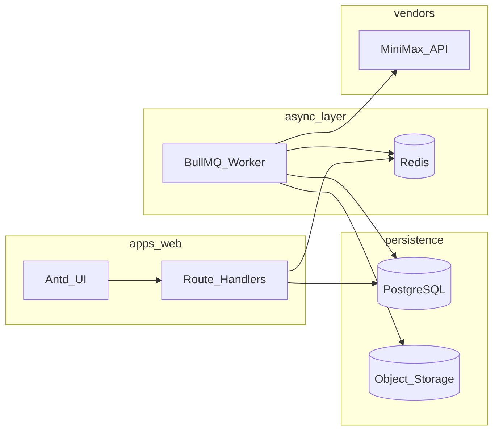

# 穿搭推荐视频生成系统 — 可执行开发计划

本文档对应需求来源：[docs/SETUP.md](docs/SETUP.md)（架构、模型、MVP、工程规则）与 [docs/INSTRUCTION.md](docs/INSTRUCTION.md)（PRD、Prisma 表结构、REST API、页面原型、实现顺序、响应格式、环境变量、交付物）。

---

## A. 需求理解（复述）

构建面向内容/电商团队的 **穿搭推荐短视频生产工具**：用户先基于角色模板与穿搭描述 **生成多张稳定首帧**，人工选定首帧后，再基于轻动作模板做 **图生短视频**；全流程 **异步可追踪**，生成物 **落自有对象存储**，**成本入账**，支持 **审核状态** 与 **任务重试**。主流程禁止偷换为「直接文生视频」。MVP 以 **MiniMax（image-01 + Hailuo 2.3-Fast）** 为首个真实 Provider；Runway 为文档要求的第二厂商（MVP 阶段可先 **接口对齐 + skeleton**）。

---

## B. 可行性结论

| 结论 | 说明 |
|------|------|
| **总体** | **可行且可落地**。技术栈与模式（App Router + Route Handlers + Prisma + BullMQ + S3 兼容存储）均为成熟组合。 |
| **高可行** | 角色模板/穿搭任务 CRUD、资产元数据、成本台账、统一 API 响应、Zod 校验、Prompt 模板化模块化。 |
| **风险/不确定** | 各厂商 API 字段与错误码随版本变化；Windows 本机跑 Worker + Redis + PostgreSQL 的运维摩擦；对象存储（S3/R2/OSS）凭证与网络策略；生成质量与可用率属业务指标非纯工程保证。 |
| **规避** | Provider 层隔离 + 原始 `raw` 落库/日志；`.env.example` 与 README 写清本地 Docker Compose 可选方案；存储抽象接口便于切换；轮询带 jitter + 指数退避（文档对 Runway 明确要求，对 MiniMax 同类处理）。 |

---

## C. 优化建议（摘要）

1. **Monorepo 按 SETUP §9**：`apps/web`、`apps/worker`、`packages/db`（Prisma）、`packages/providers`、`packages/prompts`、`packages/shared`（Zod schema、API 类型、`ApiResponse` 工具）— **降低** Web 与 Worker 重复引用 DB/Provider 的耦合成本；**代价** 是初期仓库配置略多，可用 Turborepo 或 npm workspaces 控制复杂度。  
2. **MVP 内严格区分「Provider 可调用」与「生产异步路径」**：先实现 `packages/providers` 的 MiniMax 完整封装（SETUP §16），再在 `apps/worker` 接队列（INSTRUCTION §7）；避免在页面里长期保留同步长轮询。  
3. **成本与重试**：SETUP §5.4 / §11.3 要求重试预算与可区分错误；`cost_ledgers` 与 `generation_jobs.retryCount` 联动，避免静默重复扣费语义（失败重试是否计费以厂商为准，表中 `rawBillingJson` 保留证据）。  
4. **认证选型**：文档允许 NextAuth 或更简单方案；MVP 建议 **Credentials + Prisma User** 或 **NextAuth Credentials**，满足 `admin/editor/reviewer` 与 INSTRUCTION 5.1 API 形状即可，避免过早上复杂 SaaS 权限。

---

## D. 最终技术方案（认定）

- **前端 / BFF**：[apps/web](apps/web) — Next.js App Router、TypeScript、Ant Design、Tailwind、React Query、Zustand（按需最小使用）。  
- **数据**：[packages/db](packages/db) — PostgreSQL + Prisma；Schema 以 INSTRUCTION **§4.1–4.9** 为基准（`User`、`CharacterTemplate`、`Outfit`、`GenerationJob`、`Asset`、`CostLedger`、`ReviewRecord`、`SystemSetting` 及枚举）。  
- **异步**：[apps/worker](apps/worker) — Redis + BullMQ；队列类型对齐 INSTRUCTION **§7.1**：`image_generation`、`video_generation`、`task_polling`、`asset_download`（命名可下划线转代码常量）。  
- **存储**：S3 兼容 SDK + 可配置 `STORAGE_PROVIDER`（INSTRUCTION §12）；所有对外 URL 经下载后写入 `storageBucket`/`storageKey`。  
- **Provider**：[packages/providers](packages/providers) — 实现 INSTRUCTION **§6** 的 `AiProvider` 接口族 + SETUP **§10** 的 `getCapabilities` / `estimateCost`（若 MVP 估算简化，需在 README 标明假设与后续补齐）。  
- **Prompt**：[packages/prompts](packages/prompts) — SETUP **§12–13** 模板与拼装器，禁止页面内大段字符串拼接（SETUP §24）。  
- **观测**：Sentry 可选（SETUP 技术目标列出）；至少 **结构化业务日志 + `generation_jobs` 状态机** 满足可追溯。  
- **默认模型策略**：SETUP **§26 国内默认** — `image-01`、视频 `Hailuo-2.3-Fast`（768P 试错 / 1080P 成片由 `resolution` 与任务参数控制）。

---

## E. 分步实施计划（可验收）

以下顺序 **严格对齐** INSTRUCTION **[§9 Cursor 实现顺序建议](docs/INSTRUCTION.md)**；每一步均含：做什么 / 怎么做 / 为什么 / 输出物 / 验收标准 / 风险与兜底。

---

### 步骤 1：初始化项目

| 字段 | 内容 |
|------|------|
| **做什么** | 建立 monorepo 骨架：Next.js + TS + ESLint、Ant Design、Tailwind、Prisma、Redis/BullMQ 依赖、基础布局与 `.env.example`。 |
| **怎么做** | 使用 workspaces；`apps/web` 为默认 Next 应用；`packages/db` 放 `schema.prisma`；根目录 `docker-compose`（可选）提供 `postgres`+`redis`；配置 Antd 与 Tailwind 共存（如 `ConfigProvider` + CSS 变量）。 |
| **为什么** | SETUP §9、INSTRUCTION §9 第一步：先地基避免返工。 |
| **输出物** | 可 `pnpm/npm install` + `dev` 启动的仓库；[README](README.md)；[.env.example](.env.example)（对齐 INSTRUCTION §12）。 |
| **验收标准** | 本地启动 Web；Prisma `db push` 或 migrate 可连上 PostgreSQL；能打开占位登录页/布局壳。 |
| **风险与兜底** | Windows 路径或脚本差异 → 文档中提供 PowerShell 与 Docker 两套命令；Redis 未起时 CI 可 skip E2E。 |

---

### 步骤 2：用户与认证

| 字段 | 内容 |
|------|------|
| **做什么** | `User` 模型与密码哈希；登录/登出/当前用户 API（INSTRUCTION **§5.1**）；角色 `ADMIN`/`EDITOR`/`REVIEWER`。 |
| **怎么做** | Route Handlers：`POST /api/auth/login`、`POST /api/auth/logout`、`GET /api/auth/me`；会话可用 JWT cookie 或 NextAuth session；中间件保护 `/app` 下路由。 |
| **为什么** | 所有业务操作需身份与审计字段（`createdById` 等）。 |
| **输出物** | 种子用户迁移或 `prisma seed`；受保护的管理台布局。 |
| **验收标准** | 三端点符合 §5.1 形状；未登录访问业务页跳转登录；`me` 返回角色。 |
| **风险与兜底** | NextAuth 配置坑 → MVP 可 Credentials Provider + 明确 `NEXTAUTH_SECRET`；生产再强化密码策略。 |

---

### 步骤 3：角色模板模块

| 字段 | 内容 |
|------|------|
| **做什么** | `CharacterTemplate` CRUD + 参考图上传关联 `Asset`（INSTRUCTION **§4.3**、**§5.2**、页面 **§8.3–8.4**）。 |
| **怎么做** | REST：`GET/POST /api/character-templates`，`GET/PATCH/DELETE /api/character-templates/:id`；上传走预签名或 BFF 流式至存储后写 `Asset` 再关联 `referenceAssetId`；删除前检查 `outfits` 引用（PRD §2.2）。 |
| **为什么** | 人物一致性（SETUP §6.2）依赖模板与参考图。 |
| **输出物** | 列表页 + 表单页/抽屉；Zod 校验请求体。 |
| **验收标准** | 创建/编辑/列表/详情可用；参考图可在存储中访问；删除被引用模板时返回明确业务错误码（统一 `ApiResponse`，INSTRUCTION §11）。 |
| **风险与兜底** | 大文件上传超时 → 限制大小、用直传预签名；失败回滚 DB 事务。 |

---

### 步骤 4：穿搭任务模块

| 字段 | 内容 |
|------|------|
| **做什么** | `Outfit` CRUD、任务详情页（INSTRUCTION **§4.4**、**§5.3**、页面 **§8.5–8.6**）。 |
| **怎么做** | `GET/POST /api/outfits`，`GET/PATCH /api/outfits/:id`；表单字段对齐 PRD §2.3；默认张数/时长/分辨率与业务规则一致。 |
| **为什么** | 所有 `GenerationJob` 挂载在 `outfitId`。 |
| **输出物** | 新建任务页 + 详情页骨架（任务状态、占位区块给步骤 5–8）。 |
| **验收标准** | 可创建任务并进入详情；状态默认为 `DRAFT`。 |
| **风险与兜底** | 表单过长 → 分步或 Collapse；Ant Design 与 Tailwind 冲突时以项目约定优先（少改全局共用样式，新页面用局部 class）。 |

---

### 步骤 5：MiniMax Provider

| 字段 | 内容 |
|------|------|
| **做什么** | 在 `packages/providers` 实现 MiniMax：**文/参考图生图**、**subject_reference**、**图生视频任务创建**、**任务查询**、**文件下载**、错误归一（SETUP **§16**）；接口对齐 INSTRUCTION **§6** + SETUP **§10**（capabilities、estimateCost 至少 stub 或有文档化公式）。 |
| **怎么做** | 独立 HTTP 客户端；环境变量 `MINIMAX_API_KEY`；单元测试可用 mock；提供小型 **CLI 或 `tsx` 脚本** 验证真实 API（避免步骤 6 未完成时无验收手段）。 |
| **为什么** | 文档指定第一个真实 Provider；业务层禁止直连散落调用。 |
| **输出物** | `MiniMaxProvider` 实现 + README 片段说明鉴权与限流注意。 |
| **验收标准** | 脚本或临时 route 能拉通：生成 ≥1 张图、提交 ≥1 个视频 task 并 `getTask` 读到终态之一（在沙箱 key 可用前提下）。 |
| **风险与兜底** | API 变更 → `raw` 存 `generation_jobs` / 日志；快速失败错误码映射到统一业务异常。 |

---

### 步骤 6：Worker 与队列

| 字段 | 内容 |
|------|------|
| **做什么** | `apps/worker` 消费 BullMQ；实现 INSTRUCTION **§7.2** 四类任务逻辑与状态回写。 |
| **怎么做** | Web 在 `POST /api/generations/image|video` 中创建 `GenerationJob`（`PENDING`/`QUEUED`）并入队；Worker 执行：`ImageGenerationJob`（拼 prompt → generate → download → 存 S3 → 写 `Asset` → `SUCCEEDED`）、`VideoGenerationJob`（提交后轮询入队）、`PollingJob`、`AssetDownloadJob`；指数退避 + 最大重试；`POST /api/jobs/:id/retry` 重新入队。 |
| **为什么** | SETUP §3：视频异步，避免请求超时与结果丢失。 |
| **输出物** | Worker 启动脚本与队列监控日志（基础即可）。 |
| **验收标准** | 从 UI 或 API 触发后，DB 中 job 状态机完整；失败可重试；不在 Next 请求内长阻塞等待视频完成。 |
| **风险与兜底** | Worker 崩溃 → Redis 中 job `attempts`/` stalledInterval` 配置；死信或 `FAILED` 状态 + 人工 retry。 |

---

### 步骤 7：资产入库与存储

| 字段 | 内容 |
|------|------|
| **做什么** | 全链路：厂商临时 URL → 下载 → 上传自有桶 → `Asset` 记录 `storageKey` 等（SETUP §6.5）；`GET /api/assets`、`GET /api/assets/:id`（**§5.8**）；任务详情中首帧网格与视频列表（**§8.6**）。 |
| **怎么做** | 存储抽象 `StorageAdapter`（`put`/`getSignedUrl`）；`AssetDownloadJob` 复用于图/视频。 |
| **为什么** | 不依赖 24h 等临时 URL；满足成功指标「资产落自有存储」。 |
| **输出物** | 资产库页（**§8.7**）基础列表 + 筛选占位。 |
| **验收标准** | 首帧与成片均在库内可预览（签名 URL）或下载；`isSelectedFrame` 与 **§5.5** `POST /api/assets/:id/select-frame` 打通。 |
| **风险与兜底** | 下载失败 → `DOWNLOAD_FAILED` + 重试队列；存储凭证错误快速告警日志。 |

---

### 步骤 8：审核与成本统计

| 字段 | 内容 |
|------|------|
| **做什么** | `ReviewRecord`、审核 API（**§5.9**）；`CostLedger` 写入与 `GET /api/costs/summary`（**§5.10**）；页面 **§8.8、§8.9**；`PATCH /api/outfits/:id` 与资产 `reviewStatus` 联动（按 PRD §2.8）。 |
| **怎么做** | 审核动作写 `review_records` 并更新 `Outfit.status` 或 `Asset.reviewStatus`（与枚举 `ReviewStatus` 一致）；成本在 job 成功节点按模型单价写入（与 SETUP 价格表一致，金额存 `Decimal`）。 |
| **为什么** | MVP 必做（SETUP **§21**）— 审核 + 成本 + 统计页。 |
| **输出物** | 审核页、成本汇总页（时间范围 + 按 provider/model 聚合）。 |
| **验收标准** | 审核链可查历史；成本汇总与 ledger 明细一致（抽样对账）。 |
| **风险与兜底** | 估价与实扣不一致 → `rawBillingJson` 保留厂商回包；汇总页注明「估算/以厂商为准」。 |

---

### 步骤 9：Runway Provider 预留位

| 字段 | 内容 |
|------|------|
| **做什么** | `RunwayProvider` skeleton：`name`、`getCapabilities`、方法体抛 `NotImplemented` 或 noop + 文档；工厂按 `DEFAULT_PROVIDER` 与 outfit 偏好选择（INSTRUCTION **§9 第九步**）。 |
| **怎么做** | 预留 `X-Runway-Version` 常量（SETUP §17）；类型与 MiniMax 共用接口。 |
| **为什么** | 多厂商可替换（核心价值 §1.3）。 |
| **输出物** | Provider 工厂 + 简短「接入 Runway 待办」注释或 README 小节。 |
| **验收标准** | 切换配置到 `RUNWAY` 时系统优雅失败或明确提示「未实现」；编译通过。 |
| **风险与兜底** | 避免半成品误开生产 → 管理端 `system_settings` 或 env 白名单仅 `MINIMAX`。 |

---

### 补充：系统设置与其它 API

- 实现 **§5.11** `GET/PATCH /api/settings` 与页面 **§8.10**（默认模型、重试参数、存储相关非密钥项）。  
- 补齐 SETUP **§15** 与 INSTRUCTION **§5** 中 MVP 用到的剩余端点（如 `GET /api/jobs/:id`）。  
- **统一响应** INSTRUCTION **§11**；**Zod** 校验所有写接口（§10）。

---

## F. 开始实现（在你确认之后）

你确认本计划后，将按 **步骤 1→9** 在仓库内创建代码与配置；优先跑通 **登录 → 模板 → 任务 → 首帧队列 → 选帧 → 视频队列 → 资产 → 审核 → 成本** 的 MVP 闭环，再考虑第二阶段（Runway 实接、即梦、批量导入等，见 SETUP **§22**）。

---

## 交付物清单（对齐 INSTRUCTION §13）

实现结束后交付：可运行代码、Prisma schema、SQL migrations、`.env.example`、README、Provider 设计说明、API 文档（可与 README 合并章节）、页面说明或截图、MVP 完成清单、后续待办清单。

---

## 需要你确认的两点（非阻塞但影响默认实现）

1. **包管理器**：优先 `pnpm` workspaces 还是 `npm`？（若未回复，默认 **pnpm**。）  
2. **对象存储**：开发期默认 **MinIO（Docker）** 还是直连 **Cloudflare R2**？（若未回复，默认 **Docker MinIO + S3 兼容配置**。）

请确认是否按本计划执行；确认后回复上述选项（或接受默认）即可开始编码。
