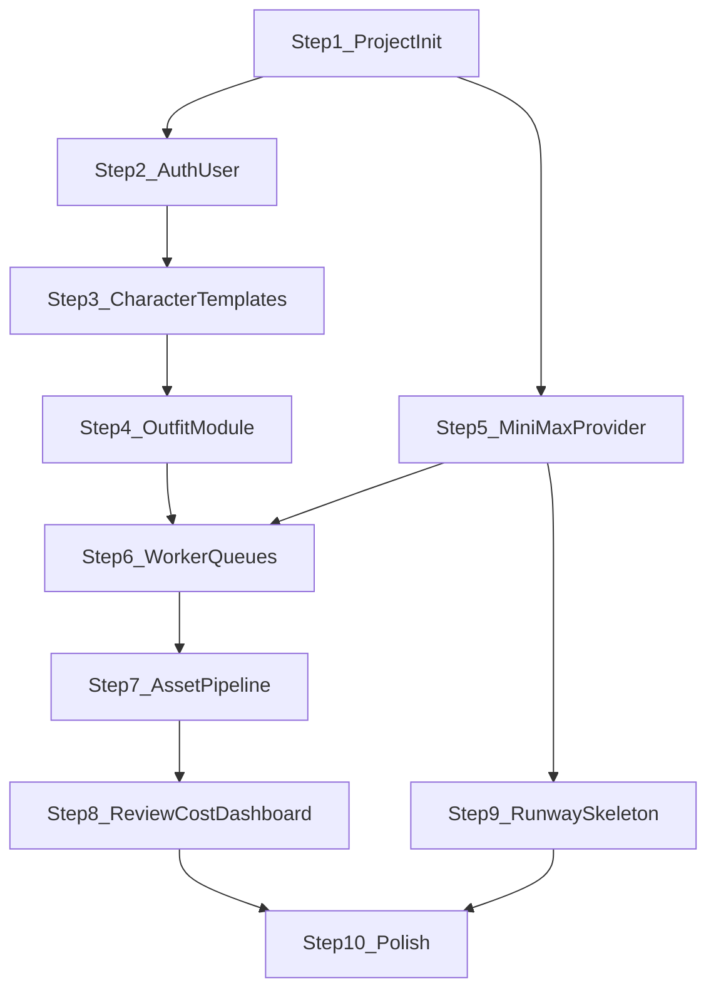
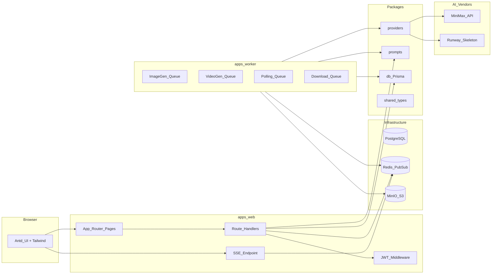

# 穿搭推荐视频生成系统 — 优化计划 v2

需求来源：[docs/SETUP.md](docs/SETUP.md) 与 [docs/INSTRUCTION.md](docs/INSTRUCTION.md)。
前版计划：[穿搭视频系统开发_058173f8.plan.md](c:\Users\www96\.cursor\plans\穿搭视频系统开发_058173f8.plan.md)。

---

## 原计划问题诊断

对照两份需求文档与实际落地需要，原计划存在以下 12 处可优化点：

---

### 优化 1：存储模块时序错误 -- 必须前置

- **问题**：原计划把「存储抽象 + 资产上传」放在步骤 7，但步骤 3（角色模板）就需要上传参考图到对象存储并写入 `Asset` 表。步骤 5（MiniMax Provider）的验收也需要把图片下载到自有存储。按原计划走，步骤 3-6 都缺少存储能力，要么跳过参考图、要么临时 hack，后期返工。
- **优化**：将 `StorageAdapter` 抽象与基础实现（S3 兼容 / 本地 MinIO）前置到步骤 1（项目初始化），与 Prisma、Redis 一起作为基础设施层。
- **收益**：步骤 3 参考图上传、步骤 5 Provider 验收脚本、步骤 6 Worker 下载回存全部直接可用，无需后补。
- **代价**：步骤 1 工作量略增，但 `StorageAdapter` 只需 `put` / `getSignedUrl` / `delete` 三个方法，可控。

---

### 优化 2：页面风格与布局体系缺失

- **问题**：原计划完全没有提及 UI 设计语言、布局骨架、主题色、组件规范。INSTRUCTION §8.1-8.10 给出了 10 个页面的区块说明，但原计划仅一句带过。一个面向内容/电商团队的生产工具，如果页面粗糙会直接影响验收与使用意愿。
- **优化**：在步骤 1 中建立完整的 UI 基础设施：
  - **整体布局**：左侧固定侧边栏导航（Logo + 菜单：控制台 / 模板 / 任务 / 资产 / 审核 / 成本 / 设置）+ 右侧主内容区 + 顶部面包屑与用户信息栏。桌面端优先（目标用户为内容团队在 PC 上操作）。
  - **主题色方向**：偏商业时尚/轻奢调性。建议主色使用深灰 + 金属质感点缀色（如 `#1a1a2e` 深底搭配 `#c9a96e` 金色 accent），或干净白底 + 中性灰 + 一个点缀色。通过 Antd `ConfigProvider` 的 `theme.token` 统一注入。
  - **卡片与网格**：模板卡片、首帧候选图、视频预览全部使用统一卡片组件（圆角 `8px`、微阴影、hover 提升）。资产库使用瀑布流或等宽网格。
  - **空状态 / 加载态**：所有列表页必须有 Antd `Empty` + 引导操作按钮；所有异步区域使用 `Skeleton` 占位。
  - **表单**：穿搭任务创建按 §8.5 做左右两栏（左 `60%` 表单、右 `40%` 实时预览 prompt + 成本估算）；长表单使用 `Collapse` 或 `Steps` 分区。
- **收益**：一致的视觉体验、减少后期返工样式 debt。
- **代价**：需要在步骤 1 多花时间建立布局壳与主题 token，约 +0.5 天。

---

### 优化 3：Antd 与 Tailwind 共存策略未定义

- **问题**：原计划提到「冲突时以项目约定优先」但没有给出约定。实际中 Antd 的全局 CSS reset 与 Tailwind 的 `preflight` 会互相覆盖按钮/链接/标题等样式，是高频踩坑点。
- **优化**：明确分工规则——
  - **Antd**：负责所有交互组件（Button, Table, Form, Modal, Drawer, Select, DatePicker 等）。
  - **Tailwind**：负责布局（flex/grid/spacing/width）、自定义区域的文字/颜色、响应式断点。
  - **禁止**：用 Tailwind 的 `btn` 类覆盖 Antd Button；用 Antd Layout 里嵌套 Tailwind 的 `container`。
  - **技术措施**：在 `tailwind.config.ts` 中设置 `corePlugins: { preflight: false }` 关闭 Tailwind 的 CSS reset，避免覆盖 Antd 基础样式。使用 `@tailwindcss/postcss` 插件配合 `postcss.config` 即可。
- **收益**：消除样式冲突的不确定性，整个项目维护者都清楚边界。
- **代价**：无。只是配置 + 团队约定。

---

### 优化 4：运行环境方案缺失

- **问题**：原计划仅说「Windows 路径差异 → 文档中提供 PowerShell 与 Docker 两套命令」，但没有给出具体方案。用户环境是 **Windows 10**，PostgreSQL + Redis 在 Windows 原生安装配置麻烦且不稳定。
- **优化**：
  - **必须提供 `docker-compose.yml`**：包含 `postgres:16`、`redis:7`、`minio`（S3 兼容本地存储）三个服务，端口映射 `5432` / `6379` / `9000`。一条 `docker compose up -d` 启动全部依赖。
  - **Node.js**：锁定 `>=18.17`，推荐 20 LTS。
  - **包管理器**：使用 `pnpm`（workspace 支持好、磁盘占用低）。根目录 `pnpm-workspace.yaml`。
  - **脚本**：`package.json` 中 `scripts` 使用 `cross-env` 消除 Windows/Unix 环境变量差异。
  - **README**：清晰的「一键启动」指引，分 Docker 用户与原生安装两种路径。
- **收益**：任何协作者（包括 CI）能在 5 分钟内拉起完整开发环境。
- **代价**：需要 Docker Desktop（Windows 上已很普及）。

---

### 优化 5：前端任务状态实时推送缺失

- **问题**：原计划 Worker 回写 DB 后，前端如何感知 Job 状态变化？文档未提及，原计划也未设计。如果靠用户手动刷新页面，体验极差。如果用 React Query 高频轮询 `/api/jobs/:id`，在并发任务多时会大量无效请求。
- **优化**：采用 **Server-Sent Events (SSE)** 方案——
  - 新增 `GET /api/jobs/:id/events` Route Handler，使用 `ReadableStream` 推送 Job 状态变更。
  - Worker 在状态变更时通过 Redis Pub/Sub 发布事件；SSE Handler 订阅对应 channel 并推送给前端。
  - 前端使用 `EventSource` 或 React Query 的 `useQuery` + `refetchInterval` 双模式：SSE 可用时实时推送，不可用时降级为 5s 轮询。
  - 为什么不用 WebSocket：SSE 单向推送足够、与 Next.js Route Handlers 兼容性好、不需要额外服务器。
- **收益**：任务详情页 §8.6 中首帧/视频状态实时刷新，用户体验从「盲等 + 手动刷新」变为「实时看到进度」。
- **代价**：Worker 多一步 Redis publish；API 多一个 SSE endpoint。复杂度可控。

---

### 优化 6：性能 -- 图片/视频加载优化缺失

- **问题**：穿搭系统核心资产是图片和视频。资产库 §8.7 是网格/瀑布流展示，一页可能 20-50 张图。任务详情 §8.6 同时展示 4 张首帧 + 2 条视频。如果不做优化，页面加载会很慢。
- **优化**：
  - **图片**：使用 Next.js `<Image>` 组件做自动格式转换 (WebP) + 响应式 `sizes` + lazy loading + blur placeholder。缩略图与原图分开存储（上传时生成 400px 缩略图）。
  - **视频**：列表页只显示封面帧（从视频第一帧截取，或用首帧图代替），点击后在 Modal/Drawer 中加载完整视频。使用 `<video preload="none" poster={thumbnailUrl}>` 避免自动下载。
  - **分页**：所有列表 API 强制分页（默认 `pageSize=20`），与 INSTRUCTION §5 一致。前端使用 React Query `keepPreviousData` 保证切页不闪白。
  - **签名 URL 缓存**：`getSignedUrl` 生成的 URL 有效期设为 1h，前端 React Query 缓存 `staleTime` 设为 50min，避免每次渲染都请求新 URL。
- **收益**：资产库页首屏加载时间可从数秒降至 1s 以内；带宽消耗下降 60%+。
- **代价**：上传时多一步缩略图生成（用 `sharp` 库，纯 Node 无外部依赖）。

---

### 优化 7：API 调用成本控制机制不足

- **问题**：原计划只提到「成本在 job 成功节点按模型单价写入」和「重试预算」。但缺少事前控制——用户可能无限制发起生成请求，直到月底账单爆掉。文档 SETUP §5.4 明确要求「重试预算 x2」，意味着系统需要主动控制。
- **优化**：
  - **事前预估**：穿搭任务创建页右侧预览区（§8.5）实时显示本次预计成本（基于所选 provider、model、count、resolution、duration 计算）。逻辑放在 `packages/providers` 的 `estimateCost` 方法中。
  - **并发限制**：BullMQ Queue 设置 `concurrency` 上限（如图片 4 并发、视频 2 并发），避免瞬间大量调用导致 rate limit 或成本失控。
  - **日预算上限**（MVP 简化版）：在 `system_settings` 中增加 `dailyBudgetLimit`，Worker 在执行 job 前查询今日已消耗金额，超限则将 job 标记为 `BUDGET_EXCEEDED` 并通知前端。
  - **成本面板增加趋势预警**：§8.9 成本统计页增加「本周/本月趋势线」与「预算消耗百分比」。
- **收益**：防止测试期意外烧钱；满足 SETUP §25.3「是否缺少成本控制」的自检。
- **代价**：Worker 多一次 DB 查询（可 Redis 缓存当日累计值）。

---

### 优化 8：Prompt Builder 模块设计未展开

- **问题**：原计划提到 `packages/prompts` 但未设计其内部结构。文档 SETUP §12-13 对 prompt 模板有详细要求（首帧 8 个维度、视频 9 个维度、镜头/动作/场景模板），如果不提前设计好接口，步骤 6 Worker 拼 prompt 时会临时拼凑。
- **优化**：在步骤 1 初始化时就建立 `packages/prompts` 的骨架——
  - `buildImagePrompt(template, outfit, camera, options)` -> 按 §12.1 拼接角色描述 + 服装 + 材质 + 镜头 + 光线 + 背景 + 构图 + 质量约束 + 稳定性约束。
  - `buildVideoPrompt(motion, camera, constraints)` -> 按 §12.2 拼接起始状态 + 动作 + 镜头运动 + 稳定性约束。
  - 预置模板数据：镜头 5 种（§13.1）、动作 7 种（§13.2）、场景 6 种（§13.3），存为 TypeScript 常量或 JSON。
  - 输出结构化 `{ text: string, json: Record<string, string> }` 以便 `generation_jobs.promptText` 和 `promptJson` 同时记录。
- **收益**：Worker 和 API 层只需调用 builder 函数，不做字符串拼接；prompt 可独立迭代和 A/B 测试。
- **代价**：前置少量设计工作，但避免了后期 prompt 散落在各处的技术债。

---

### 优化 9：Dashboard 首页被遗漏

- **问题**：INSTRUCTION §8.2 定义了「首页/控制台」——今日生成数、今日成功率、今日成本、最近任务列表、最近待审核资产、快速入口。原计划完全没有提及这个页面。
- **优化**：在步骤 8（审核与成本统计）中同步实现 Dashboard 页，因为它依赖 `generation_jobs`、`cost_ledgers`、`assets` 的聚合查询。新增 `GET /api/dashboard/summary` 接口返回当日汇总。
- **收益**：用户登录后第一眼看到系统运行概况，符合「生产型工具」定位。
- **代价**：一个聚合查询 API + 一个页面，工作量可控。

---

### 优化 10：数据库索引策略缺失

- **问题**：原计划直接使用 INSTRUCTION §4 的 Prisma schema 但未提及索引。在 `generation_jobs`（高频写入+查询）、`assets`（筛选+分页）、`cost_ledgers`（聚合统计）上缺少复合索引会导致查询性能随数据量增长迅速下降。
- **优化**：在 Prisma schema 中补充关键索引——
  - `GenerationJob`: `@@index([outfitId, stage])`, `@@index([status])`, `@@index([createdAt])`
  - `Asset`: `@@index([type, reviewStatus])`, `@@index([createdAt])`
  - `CostLedger`: `@@index([provider, createdAt])`, `@@index([generationJobId])`
  - `Outfit`: `@@index([status])`, `@@index([createdById, createdAt])`
- **收益**：列表查询和聚合统计在万级数据量下仍保持毫秒级。
- **代价**：写入性能略有开销，但本系统写入频率远低于查询频率，可忽略。

---

### 优化 11：认证方案过度复杂

- **问题**：原计划提到 NextAuth 但也说「可 Credentials Provider」。NextAuth v5 (Auth.js) 在 App Router 下的配置复杂度较高，且本项目只需要最基础的邮箱密码登录 + 角色判断，不需要 OAuth、Magic Link 等。引入 NextAuth 反而增加了依赖和配置复杂度。
- **优化**：MVP 直接使用 **自定义 JWT + HttpOnly Cookie** 方案——
  - 登录时 `bcrypt` 验证密码 -> 签发 JWT（含 `userId`, `role`, `exp`）-> 写入 `HttpOnly` cookie。
  - 中间件读取 cookie 验证 JWT、注入 `currentUser` 到请求上下文。
  - 只需 `jose` (JWT) + `bcrypt` 两个依赖，零框架配置。
  - 如果后续需要 OAuth 等高级功能，再迁移到 NextAuth，成本很低因为 User 表结构兼容。
- **收益**：减少一个重量级依赖；认证流程完全可控、易调试。
- **代价**：需自己写 ~100 行认证中间件代码，但逻辑清晰。

---

### 优化 12：步骤粒度与并行度优化

- **问题**：原计划 9 步严格串行。但实际上：步骤 5（MiniMax Provider）与步骤 2-4（CRUD 页面）没有依赖关系，可以并行开发。步骤 7（存储）如前所述应前置。步骤 9（Runway skeleton）很轻量可以与步骤 8 合并。
- **优化**：重新编排依赖关系（见下方新计划），减少关键路径长度。同时将「系统设置页」「Dashboard」合并到步骤 8，避免零散的「补充」步骤。

---

## 新计划：分步实施（优化后）

---

### 步骤 1：项目初始化 + 基础设施 + UI 骨架

**做什么**

建立 monorepo 骨架，包含所有基础设施层：DB、Redis、对象存储、UI 布局壳、Prompt Builder 骨架。

**怎么做**

- pnpm workspace：`apps/web`、`apps/worker`、`packages/db`、`packages/providers`、`packages/prompts`、`packages/shared`
- `apps/web`：`create-next-app` + App Router + TypeScript strict
- Antd + Tailwind 共存：`tailwind.config.ts` 中 `corePlugins: { preflight: false }`；Antd 通过 `ConfigProvider` 注入自定义 token（主色、圆角、字体）
- UI 布局壳：侧边栏导航（Logo + 菜单项占位）+ 主内容区 + 面包屑 + 用户头像/退出
- 主题风格：商业时尚调性，白底 + 中性灰文字 + 一个金色/铜色点缀色 accent，卡片圆角 `8px`，微阴影
- `packages/db`：Prisma schema（完整对齐 INSTRUCTION §4.1-4.9 + 补充索引）+ migration
- `packages/shared`：`ApiResponse<T>` 类型、Zod 通用 schema（分页参数等）、统一错误码枚举
- `packages/prompts`：骨架 + 预置模板常量（§13.1 镜头 5 种、§13.2 动作 7 种、§13.3 场景 6 种）+ `buildImagePrompt` / `buildVideoPrompt` 接口签名
- `packages/providers`：`AiProvider` 接口定义（对齐 INSTRUCTION §6 + SETUP §10 capabilities）
- 存储抽象：`StorageAdapter` (`put` / `getSignedUrl` / `delete`) + S3 兼容实现（连接 MinIO 或真实 S3）
- `docker-compose.yml`：`postgres:16` + `redis:7-alpine` + `minio`
- `.env.example`（对齐 INSTRUCTION §12）、`README.md`（一键启动指引）

**为什么**

将存储、Prompt、Provider 接口、UI 骨架全部前置到地基阶段。后续步骤只需填充具体实现，不再回头补基础设施。SETUP §9 要求「先把地基搭好，避免后期返工」。

**输出物**

可 `pnpm dev` 启动的 Web 应用（显示布局壳 + 占位登录页）；`docker compose up` 一键拉起依赖；Prisma migrate 完成全部建表。

**验收标准**

- `pnpm install` + `docker compose up -d` + `pnpm db:migrate` + `pnpm dev` 可在 Windows 上完整跑通
- 浏览器打开 `localhost:3000` 看到侧边栏布局与登录页占位
- MinIO Console `localhost:9001` 可访问

**风险与兜底**

Docker Desktop 未安装 -> README 提供 Windows 原生安装 PostgreSQL + Redis 的备选指引。Antd+Tailwind 样式冲突 -> 已通过 `preflight: false` 规避。

---

### 步骤 2：用户与认证

**做什么**

实现登录/登出/当前用户 API + 登录页 UI + 路由保护中间件 + seed 用户。

**怎么做**

- 自定义 JWT 方案：`POST /api/auth/login` 验证 `bcrypt` 密码后签发 JWT（`jose` 库），写入 `HttpOnly` + `SameSite=Lax` cookie；`POST /api/auth/logout` 清除 cookie；`GET /api/auth/me` 从 cookie 解析用户信息。
- Next.js middleware：拦截 `/app/*` 路由，无有效 JWT 则 302 到 `/login`。
- 登录页 UI：居中卡片（Logo + 系统名称 + email/password + 登录按钮 + 错误提示），参考 §8.1。
- `prisma/seed.ts`：创建 admin 用户（`admin@example.com` / 初始密码）。
- 角色权限：中间件注入 `currentUser` 到请求上下文（通过 `headers` 或 `cookies` 传递到 Route Handler）；敏感 API 检查角色。

**为什么**

所有业务操作挂载 `createdById`，必须先有认证。自定义 JWT 比 NextAuth 更轻量、适合 MVP，后续可平滑迁移。

**输出物**

登录页（可用）、受保护的管理台布局、seed 用户。

**验收标准**

- 三个 API 端点响应格式符合 INSTRUCTION §5.1
- 未登录访问 `/app/dashboard` 自动跳转 `/login`
- `GET /api/auth/me` 返回 `{ success: true, data: { id, name, email, role } }`

**风险与兜底**

JWT secret 泄露 -> 环境变量管理 + `.env` 不入库。Cookie 跨域 -> 开发期 `localhost` 同源无此问题。

---

### 步骤 3：角色模板模块

**做什么**

`CharacterTemplate` CRUD + 参考图上传 + 列表页（卡片模式）+ 详情页/编辑抽屉。

**怎么做**

- API：`GET/POST /api/character-templates`、`GET/PATCH/DELETE /api/character-templates/:id`（对齐 §5.2）
- 参考图上传：前端选择文件 -> 调 `POST /api/upload` -> BFF 用 `StorageAdapter.put()` 写入 MinIO/S3 -> 返回 `assetId` -> 表单提交时关联 `referenceAssetId`
- 列表页（§8.3）：搜索框 + 新建按钮 + 卡片网格（模板名 / 缩略参考图 / 默认镜头 / 默认动作 / 创建时间 / 操作按钮）+ 分页
- 详情页（§8.4）：基础信息 + 参考图大图 + 默认参数 + 关联任务列表（占位）+ 编辑按钮
- 删除前检查 `outfits` 引用，有引用则返回 `TEMPLATE_IN_USE` 错误码
- 所有请求体 Zod 校验

**页面风格**

卡片使用 Antd `Card` + hover 阴影提升；参考图使用 `Image` 组件 + 圆角裁剪；空状态「还没有角色模板，立即创建」+ 引导按钮。

**为什么**

人物一致性（SETUP §6.2）依赖角色模板和参考图，是首帧稳定的基础。

**输出物**

模板列表页、创建/编辑表单（Modal 或 Drawer）、详情页。

**验收标准**

- 可创建含参考图的模板，参考图在 MinIO 中可访问
- 列表分页、搜索可用
- 删除被引用模板返回明确错误

**风险与兜底**

大文件上传 -> 限制参考图 <=10MB；上传失败 -> 前端 retry + 错误提示。

---

### 步骤 4：穿搭任务模块

**做什么**

`Outfit` CRUD + 新建任务页（两栏布局）+ 任务详情页骨架。

**怎么做**

- API：`GET/POST /api/outfits`、`GET/PATCH /api/outfits/:id`（对齐 §5.3）
- `GET /api/outfits/:id` 返回：任务详情 + 角色模板 + 关联 jobs + 关联 assets + 审核记录 + 成本汇总（后三项先返回空数组/零值）
- 新建页（§8.5）：**左栏 60%**（基础信息 -> 角色模板 Select -> 穿搭描述 Collapse[上装/下装/鞋/包/配饰/材质/配色] -> 场景与镜头 -> 模型参数 -> 提交按钮）；**右栏 40%**（Prompt 实时预览 Card + 预计成本 Statistic + 动作模板说明 + 生成策略提示）
- 右栏 Prompt 预览调用 `packages/prompts` 的 `buildImagePrompt` 在客户端实时渲染（纯计算无 API 调用）
- 右栏成本预估调用 provider 的 `estimateCost` 逻辑（可内联在前端的配置常量中，不需 API）
- 任务详情页（§8.6）骨架：任务基础信息 Card + 「首帧候选」Section（占位）+ 「视频任务」Section（占位）+ 「审核记录」Section（占位）+ 「成本统计」Section（占位）+ 「Job 时间线」Section（占位）
- 默认值：4 张图、2 条视频、6 秒、768P、轻动作模板、MiniMax

**页面风格**

两栏布局右侧为 `sticky` 定位，表单滚动时预览区跟随。Prompt 预览使用 code 风格 Card（monospace 字体、浅灰底）。成本使用 Antd `Statistic` 组件 + 金色数字。

**为什么**

所有 `GenerationJob` 挂载在 `outfitId`，任务模块是后续生成、审核、成本的枢纽。

**输出物**

新建任务页（含实时预览）+ 详情页骨架。

**验收标准**

- 可创建任务，默认状态 `DRAFT`
- 右栏实时显示拼接 prompt 和预估成本
- 详情页正确加载任务信息

**风险与兜底**

表单字段多 -> Collapse 分区 + 默认值预填减轻用户负担。Antd Form 与 Tailwind 两栏布局 -> 外层用 Tailwind grid，内部 Form.Item 用 Antd。

---

### 步骤 5：MiniMax Provider 实现（可与步骤 2-4 并行）

**做什么**

在 `packages/providers` 中完整实现 MiniMax：图片生成（含 `subject_reference`）、图生视频任务创建、任务查询、文件下载、成本估算、错误归一。

**怎么做**

- 实现 `MiniMaxProvider implements AiProvider`
- HTTP 客户端：`fetch` 或 `undici`，统一错误处理（超时、HTTP 错误码、业务错误码映射）
- `generateImages`：调用 `image-01`，支持 `subject_reference`、`seed`、batch `count`
- `generateVideoFromImage`：调用 `Hailuo-2.3-Fast`，提交首帧 + prompt，返回 `taskId`
- `getTask`：查询 task 状态，映射到统一 `JobStatus` 枚举
- `downloadAsset`：通过 `file_id` 获取下载 URL 并 stream 下载为 Buffer
- `estimateCost`：基于 SETUP §5.2 价格表，按 `model + resolution + duration` 计算
- `getCapabilities`：返回 MiniMax 支持的功能标记（对齐 SETUP §10）
- 验收脚本：`packages/providers/scripts/test-minimax.ts`（`tsx` 运行），可独立验证 API 连通性

**为什么**

SETUP §16 要求第一个真正实现的 Provider。独立包便于单元测试和脚本验收，不依赖 Web 或 Worker。

**输出物**

`MiniMaxProvider` 完整实现 + 验收脚本 + README 片段。

**验收标准**

- 验收脚本可生成 >=1 张图、提交 >=1 个视频 task 并读到终态（在 API Key 可用前提下）
- 所有方法有 TypeScript 类型签名
- 错误映射到统一 `ProviderError` 类型

**风险与兜底**

API Key 无法获取 -> 提供 mock provider 用于 UI 开发和 Worker 联调。API 变更 -> `raw` 原始响应始终记录。

---

### 步骤 6：Worker 与队列

**做什么**

`apps/worker` 消费 BullMQ 四队列 + 完整 Job 状态机 + SSE 推送基础。

**怎么做**

- 四队列：`image-generation`、`video-generation`、`task-polling`、`asset-download`（对齐 INSTRUCTION §7.1）
- `ImageGenerationJob`：读 job -> `packages/prompts` 拼 prompt -> `provider.generateImages` -> 逐张 `StorageAdapter.put` -> 创建 `Asset` -> 更新 job `SUCCEEDED` -> 写 `CostLedger` -> Redis publish 状态变更
- `VideoGenerationJob`：读首帧 Asset URL -> 拼视频 prompt -> `provider.generateVideoFromImage` -> 保存 `providerTaskId` -> 入 `task-polling` 队列
- `PollingJob`：`provider.getTask` 查状态 -> 成功则入 `asset-download` 队列 -> 失败写错误 -> 运行中则延迟重入 polling（指数退避 5s -> 10s -> 20s -> ... 最大 60s，加 jitter）
- `AssetDownloadJob`：下载 -> 上传存储 -> 创建 Asset -> 更新 job -> 写 cost -> Redis publish
- 重试策略：BullMQ `attempts` = `system_settings.maxRetryCount`（默认 2）；`backoff: { type: 'exponential', delay: 5000 }`；仅对可重试错误自动重试
- 日预算检查：Worker 执行前查 Redis 缓存的当日累计成本，超限标记 `BUDGET_EXCEEDED`
- Web 端：`POST /api/generations/image` 创建 N 个 `GenerationJob` (`PENDING`) 并入队；`POST /api/generations/video` 同理；`POST /api/jobs/:id/retry` 重入队
- SSE：`GET /api/jobs/:id/events` Route Handler 订阅 Redis channel `job:{id}:status`

**为什么**

SETUP §3 / §11 明确要求异步架构。Worker 是系统核心引擎，所有生成、轮询、下载、计费在此收口。SSE 让前端实时感知状态变更。

**输出物**

Worker 服务（`pnpm --filter worker start`）、generation API、SSE endpoint。

**验收标准**

- 从 API 触发图片生成 -> Worker 消费 -> 图片落存储 -> Asset 入库 -> Job 状态 `SUCCEEDED`
- 从 API 触发视频生成 -> 轮询 -> 下载 -> Asset 入库
- 前端 SSE 能收到状态变更事件
- 失败 job 可通过 retry API 重新入队
- 日预算超限时 job 不执行

**风险与兜底**

Worker 崩溃 -> BullMQ `stalledInterval` 30s 自动重分配。Redis 断连 -> 重连策略 + 日志告警。MiniMax API 限流 -> queue concurrency 控制（图片 4、视频 2）。

---

### 步骤 7：资产管道与任务详情页完善

**做什么**

完善任务详情页（首帧网格 + 选帧 + 视频区 + Job 时间线）+ 资产库页。

**怎么做**

- 任务详情页（§8.6）填充：
  - **首帧候选区**：4 宫格卡片，每张显示缩略图 / model / seed / 成本 / 状态 badge / 操作（选为首帧、废弃、查看大图、下载）
  - **选帧操作**：调 `POST /api/assets/:id/select-frame`，被选中卡片高亮边框
  - **视频区**：视频卡片（封面帧 + 模型 / 时长 / 成本 / 状态 / 操作[重试/审核/下载]），点击在 Modal 播放
  - **Job 时间线**：Antd `Timeline` 组件，展示 job 创建 -> 排队 -> 执行 -> 成功/失败的时间节点
  - **实时刷新**：React Query `useQuery` + SSE 自动更新
- 资产库页（§8.7）：
  - 筛选栏：类型 / Provider / 审核状态 / 日期范围 / 所属任务
  - 等宽网格（responsive: 2-4 列），每个卡片缩略图 + 类型 badge + 状态 tag
  - 点击打开详情 Drawer：大图/视频 + 来源 outfit + 来源 job + prompt + seed + 成本 + 下载 + 审核记录
- `GET /api/assets` 分页 + 筛选；`GET /api/assets/:id` 含关联信息

**页面风格**

首帧网格：选中态金色边框 + check icon；废弃态半透明 + 删除线。视频卡片：左侧封面帧（圆角）+ 右侧信息。资产库网格：hover 放大 + 底部半透明信息条。

**为什么**

任务详情页是 §8.6 定义的「主工作台」，是用户操作最频繁的页面。资产库是生成物的沉淀入口。

**输出物**

完善的任务详情页 + 资产库页。

**验收标准**

- 从创建任务 -> 生成首帧 -> 选帧 -> 生成视频 -> 查看视频 -> 资产库可找到，闭环跑通
- 图片使用缩略图加载、视频使用封面帧 + 懒加载
- 分页与筛选正常工作
- SSE 实时更新 job 状态

**风险与兜底**

图片/视频数量多时卡顿 -> 虚拟滚动（ant-design 的 `List` grid + 分页已足够 MVP）。签名 URL 过期 -> 前端检测 403 自动刷新 URL。

---

### 步骤 8：审核 + 成本统计 + Dashboard + 系统设置

**做什么**

实现审核流、成本面板、首页控制台、系统设置页——将原计划步骤 8 + 遗漏的 Dashboard + 系统设置合并。

**怎么做**

- **审核**（§8.8）：
  - `POST /api/reviews` + `GET /api/reviews`（对齐 §5.9）
  - 审核页：待审核资产列表 + 资产预览（图片/视频）+ 通过/驳回/归档按钮 + 备注 TextArea
  - 审核动作写 `ReviewRecord` + 联动更新 `Asset.reviewStatus` / `Outfit.status`
- **成本统计**（§8.9）：
  - `GET /api/costs/summary`（对齐 §5.10）
  - 页面：时间范围 DatePicker + 总成本 Statistic + 成功率/失败率 Statistic + 按 Provider 饼图（Antd Charts 或 `@ant-design/charts`）+ 按模型柱状图 + 最近异常任务表
  - 趋势预警：本周日均 vs 上周日均对比
- **Dashboard**（§8.2）：
  - `GET /api/dashboard/summary`：今日生成数 / 今日成功率 / 今日成本 / 最近 5 条任务 / 最近 5 个待审核资产
  - 页面：4 个 Statistic 卡片（顶部一行）+ 最近任务 Table + 待审核 List + 快速入口 4 个按钮
- **系统设置**（§8.10）：
  - `GET/PATCH /api/settings`（对齐 §5.11）
  - 页面：表单分区（Provider 配置 / 对象存储 / 默认模型 / 默认参数 / 重试配置）+ 保存按钮
  - API Key 使用 password 输入框，保存时加密存储（或标记为 sensitive 不回显明文）

**为什么**

审核、成本、统计是 MVP 必做（SETUP §21）。Dashboard 是用户登录后首页（§8.2）。系统设置是管理员配置入口。四者合并为一步因为它们都依赖前面所有步骤已就绪。

**输出物**

审核页、成本统计页、Dashboard 首页、系统设置页。

**验收标准**

- 审核动作可写入并联动状态变更
- 成本汇总数字与 `cost_ledgers` 明细一致
- Dashboard 卡片数字正确
- 系统设置修改后生效（如改变默认图片张数，新建任务默认值跟随）

**风险与兜底**

聚合查询慢 -> 利用索引 + 限制 Dashboard 只查当日数据。图表库体积大 -> 按需引入 `@ant-design/charts` 的饼图和柱状图。

---

### 步骤 9：Runway Provider 预留位（可与步骤 8 并行）

**做什么**

`RunwayProvider` skeleton + Provider 工厂完善。

**怎么做**

- `RunwayProvider implements AiProvider`：所有方法抛 `ProviderNotImplementedError` 并返回友好信息
- `getCapabilities` 返回 Runway 已知的能力标记（SETUP §10）
- `estimateCost` 基于 SETUP §5.3 价格表实现（这个可以先做，不需要 API Key）
- Provider 工厂 `getProvider(name: ProviderName): AiProvider`，按 `system_settings.defaultProvider` 或 `outfit.providerPreference` 选择
- 预留 `X-Runway-Version: 2024-11-06` 常量
- 系统设置页 Provider 下拉仅允许选择已实现的 Provider（MiniMax），Runway 灰色标注「即将支持」

**为什么**

满足多厂商可替换架构（SETUP §10 / INSTRUCTION §1.3）。

**输出物**

Provider 工厂、Runway skeleton、README 小节。

**验收标准**

- `getProvider('MINIMAX')` 返回 MiniMaxProvider
- `getProvider('RUNWAY')` 返回 RunwayProvider，调用方法时返回明确 `NotImplemented` 错误
- 编译通过，类型安全

**风险与兜底**

误切到 Runway -> 系统设置 UI 限制 + Worker 执行前检查 capabilities。

---

### 步骤 10：收尾打磨与交付

**做什么**

全局空状态、错误边界、README 完善、API 文档、MVP 完成清单。

**怎么做**

- 全部页面补充 Empty 状态 + Loading Skeleton + ErrorBoundary
- 统一 API 错误处理：500 页面、toast 提示
- README：项目介绍、架构说明、快速启动、环境变量说明、API 概览
- `.env.example` 完整化
- Provider 设计说明文档
- MVP 完成清单 vs SETUP §21 逐项对账
- 后续待办清单（第二阶段：Runway 实接、即梦、批量导入、AI 质检、爆款模板、商品库联动 -- SETUP §22）

**为什么**

交付物要求（INSTRUCTION §13）。MVP 需要「可用」而非「能跑」。

**输出物**

完整交付包：代码 + schema + migration + 文档 + 清单。

**验收标准**

- INSTRUCTION §13 的 10 项交付物全部具备
- SETUP §21 MVP 必做 10 项全部完成
- 所有页面无白屏、无未处理异常

---

## 技术架构总览（优化后）

---

## 关键约定汇总

- **包管理器**：pnpm
- **Node.js**：>=18.17（推荐 20 LTS）
- **本地依赖**：Docker Compose（PostgreSQL 16 + Redis 7 + MinIO）
- **认证**：自定义 JWT + HttpOnly Cookie（`jose` + `bcrypt`）
- **Antd + Tailwind**：Antd 管组件，Tailwind 管布局，`preflight: false`
- **状态管理**：React Query（服务端数据）+ Zustand（极少量客户端状态如侧边栏折叠）
- **实时推送**：SSE + Redis Pub/Sub，降级 5s 轮询
- **图片优化**：Next.js Image + 缩略图（sharp）+ lazy load
- **视频预览**：封面帧 + `preload="none"` + Modal 播放
- **成本控制**：事前预估 UI + Worker 日预算检查 + BullMQ concurrency 限制
- **统一响应**：`ApiResponse<T>` + Zod 校验 + 统一错误码
